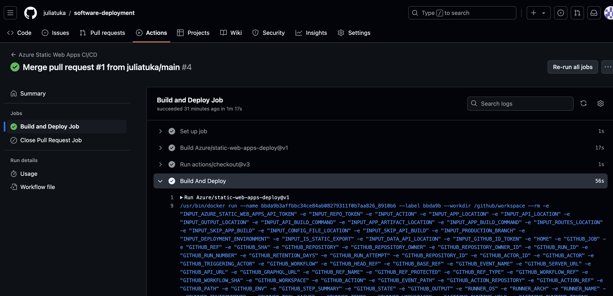
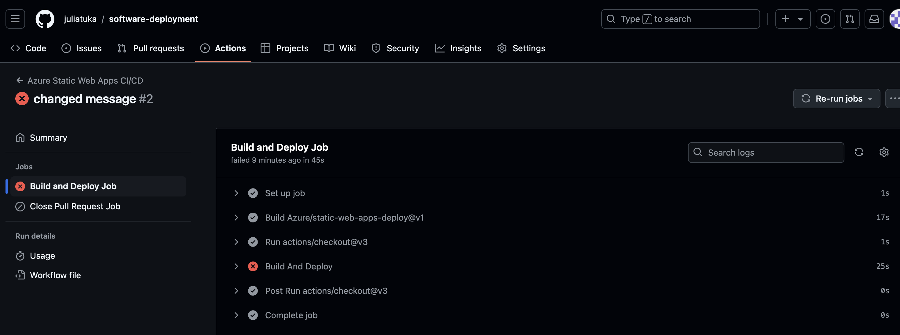
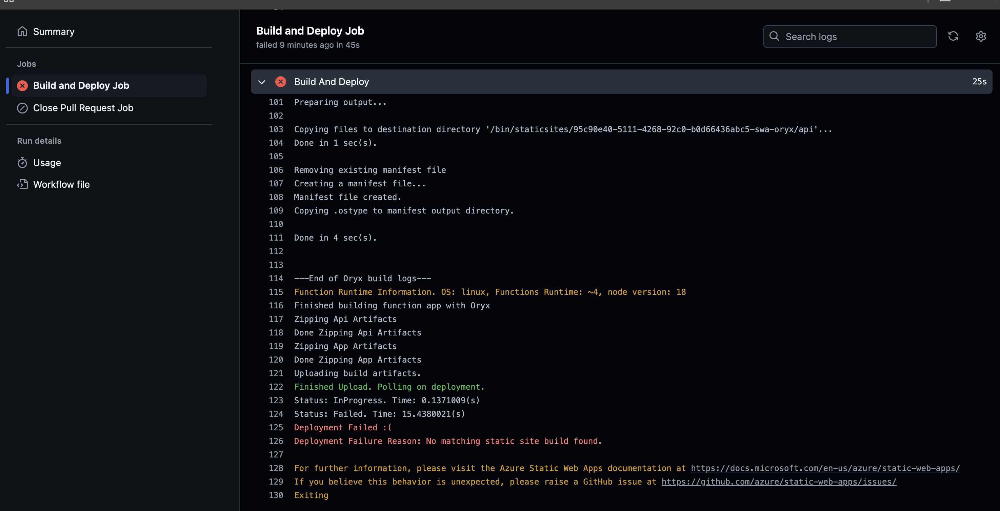
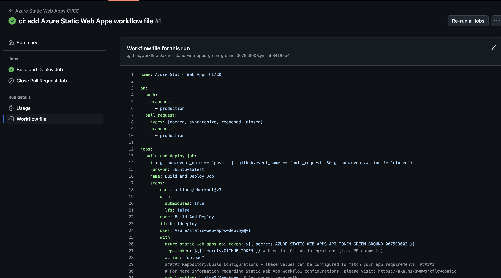
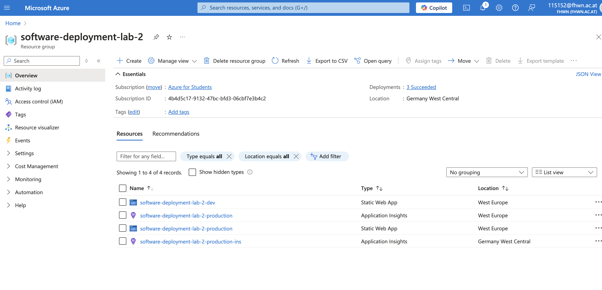
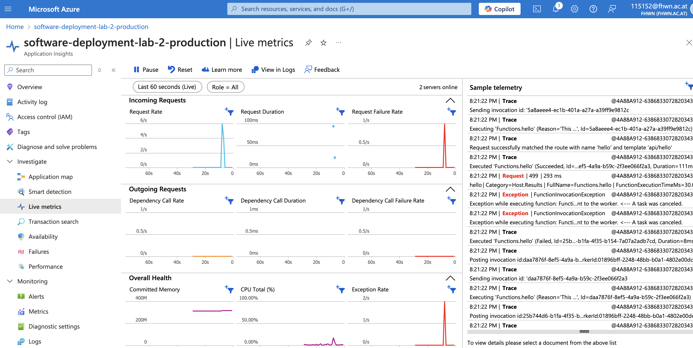

# Lab1: Azuer DevOps Pipelines

## Links zu den Azure Static Web Apps

- `dev`: https://gray-grass-0a8baee03.5.azurestaticapps.net/api/hello
- `production`: https://green-ground-0075c3003.5.azurestaticapps.net/api/hello

## Deployments

Successfull Depolyment:

Failed Deployment:

### Release Pipeline 

### Application Insights

After going into the `Static Web App` under `Application Insights` you can Enable Application Insights.
If you have done that the Static Web App and the new Appication Inisght should be seen in the resource group. 

When clicking into the newly created `Application Insight` you should be able to see into the `Live metrics` that show the ingoing and outgoing requests coming from your static web app.

## Release Pipeline

1. `Go to GitHub --> Pull Request`

2. `Select a New pull request`

3. `Select the production branch as the base and the main branch for compare`

4. `Then Create pull request and merge it into the production branch`

5. `Wait until the static web app has deployed again`

