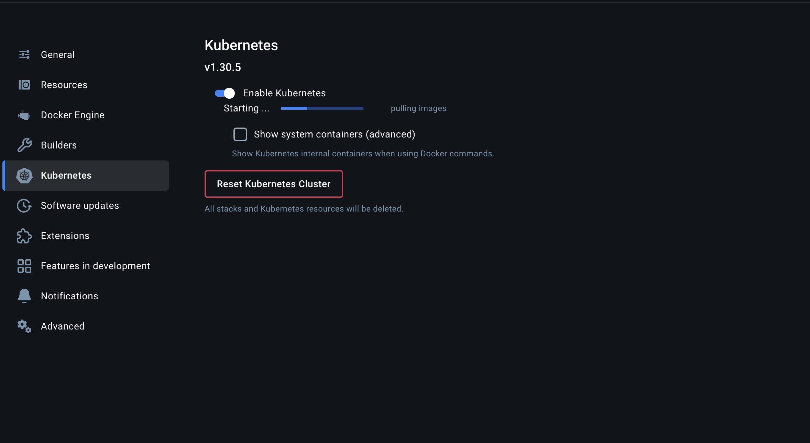
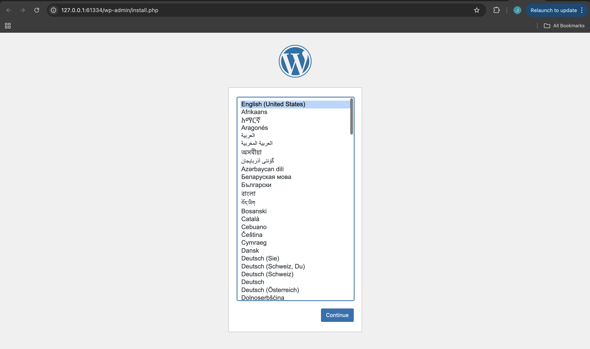
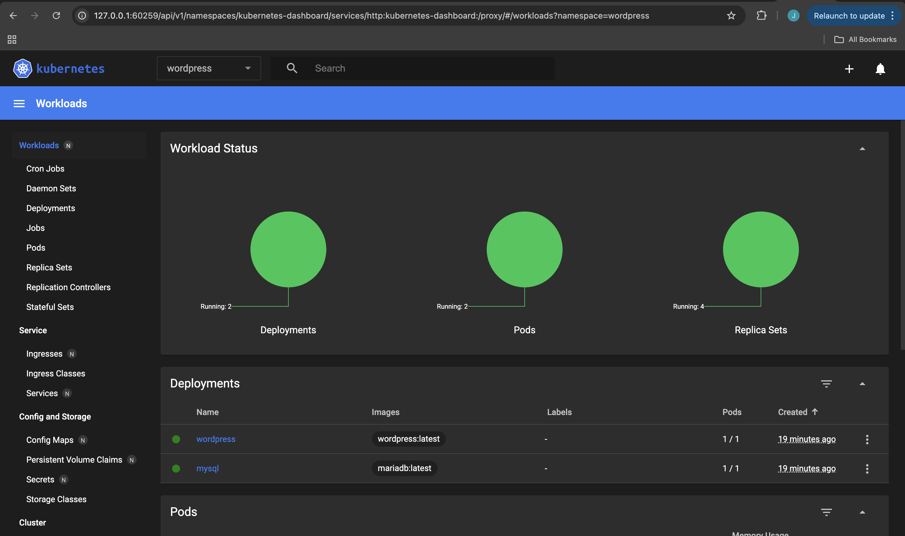
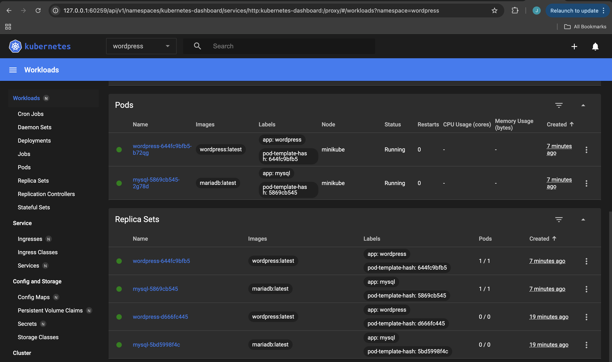

# Lab4: WordPress and MySQL Deployment on Kubernetes using Minikube

This project demonstrates how to deploy WordPress and MySQL on a local Kubernetes cluster using Minikube. 

## Key Notes
- Ensure Minikube is installed and running. 
```
brew install minikube
```

- Install kubectl, the Kubernetes command-line tool. 
```
brew install kubectl
```
- Ensure Docker Destop is installed and running.

After installing and starting Docker Desktop aktivate Kubernetes in the Docker Settings: 



## Steps for Deployment

To start Minikube with a driver (e.g., Docker):
````
minikube start --driver=docker
````

Create a namespace for the WordPress deployment:
````
kubectl create namespace wordpress
````

Deploy the MySQL database with Persistent Volume:
````
kubectl apply -f mysql-pvc.yaml
kubectl apply -f mysql-deployment.yaml
kubectl apply -f mysql-service.yaml
````

Deploy the WordPress application:
````
kubectl apply -f wordpress-deployment.yaml
kubectl apply -f wordpress-service.yaml
````

Access WordPress:
````
minikube service wordpress -n wordpress
````
Open the URL in a browser to access the WordPress setup.



## File Description
1. `mysql-pvc.yaml`: Defines a Persistent Volume Claim for MySQL to ensure data persists even if the pod is restarted.

2. `mysql-deployment.yaml`: Deploys a MariaDB instance for the WordPress database including environment variables for database credentials.

3. `mysql-service.yaml`: Exposes the MySQL database as a ClusterIP service, allowing internal access within the cluster.

4. `wordpress-deployment.yaml`: Deploys a WordPress application container with Environment variables pointing to the MySQL service for the database connection.

5. `wordpress-service.yaml`: Exposes WordPress as a NodePort service for external access.

## Kubernetes Dashboard

To monitor the cluster:

````
minikube dashboard
````

and select the `wordpress` namespace to view the resources.






## Testing and Debugging

If you want to check the Pod Status:
````
kubectl get pods -n wordpress
````

If you like to check the Logs for MySQL/Wordpress:
````
kubectl logs -n wordpress mysql-<POD_NAME>
kubectl logs -n wordpress wordpress-<POD_NAME>
````

If you want to check the services and their endpoints:
````
kubectl get services -n wordpress
````

